# Hyperbolic PDEs: Linear Advection and Burgers Equation

Numerical simulation of one-dimensional hyperbolic partial differential equations using explicit finite-difference methods. The project studies the linear advection equation and the inviscid Burgers equation, with emphasis on CFL stability, upwind/downwind discretizations, Lax-Friedrichs stabilization, numerical diffusion, boundary conditions, error analysis, runtime analysis and GIF-based visualization of the time evolution.

This repository is a cleaned computational-physics portfolio version of a coursework project from my final year Physics degree at the University of Alicante.

---

## Scientific motivation

Hyperbolic partial differential equations describe propagation phenomena. Unlike elliptic equations, which describe stationary equilibrium, or parabolic equations, which describe diffusion, hyperbolic equations transport information with finite speed. This makes the direction of propagation essential.

The same finite-difference formula can behave very differently depending on whether it respects the physical direction of information flow. This repository demonstrates that idea by comparing centered, upwind, downwind and Lax-Friedrichs schemes.

The simulations show:

- why the CFL condition is necessary,
- why FTCS is unstable for pure advection,
- why upwind schemes are stable but diffusive,
- why downwind schemes fail for the wrong propagation direction,
- why Lax-Friedrichs stabilizes the solution through artificial diffusion,
- why Burgers equation is more demanding because the wave speed depends on the solution itself.

---

## Equations studied

The first equation is the linear advection equation:

$$
\frac{\partial u}{\partial t}
+
c
\frac{\partial u}{\partial x}
=
0.
$$

The second equation is the inviscid Burgers equation:

$$
\frac{\partial u}{\partial t}
+
u
\frac{\partial u}{\partial x}
=
0,
$$

or, in conservative form,

$$
\frac{\partial u}{\partial t}
+
\frac{\partial}{\partial x}
\left(
\frac{u^2}{2}
\right)
=
0.
$$

---

## 1. Linear advection

The advection simulation transports a square pulse through a periodic one-dimensional domain. In the exact solution, the pulse should move without changing shape:

$$
u(x,t)=u_0(x-ct).$$

This makes the problem a clean benchmark for numerical methods. Any smoothing, oscillation or growth of the pulse is caused by the discretization.

### Advection methods comparison


The animation compares the main explicit schemes. It makes the different numerical behaviours visible: stable transport, artificial diffusion, oscillatory behaviour and instability.

### Upwind advection

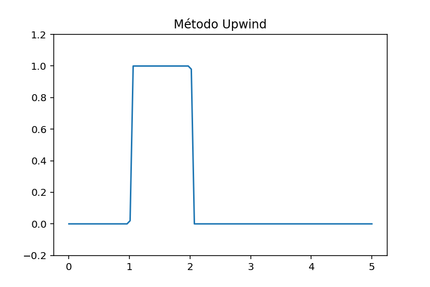

The upwind method respects the propagation direction for positive velocity. It remains stable under the CFL condition, but it smooths the sharp discontinuities of the square pulse.

### Downwind advection

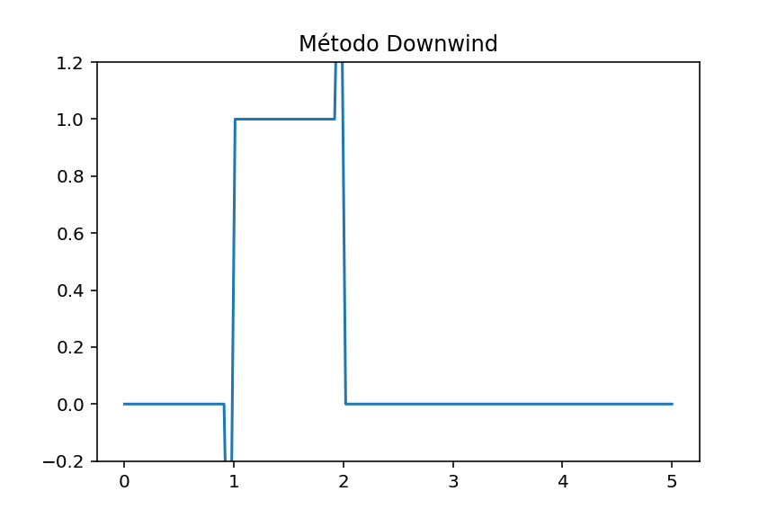

The downwind method uses information from the wrong side of the grid for positive advection speed. This violates the physical direction of propagation and leads to unstable or strongly distorted behaviour.

### FTCS / centered advection


The centered method is formally simple but unstable for pure advection with forward time integration. It does not introduce the directional dissipation needed to control high-frequency components.

### Lax-Friedrichs advection

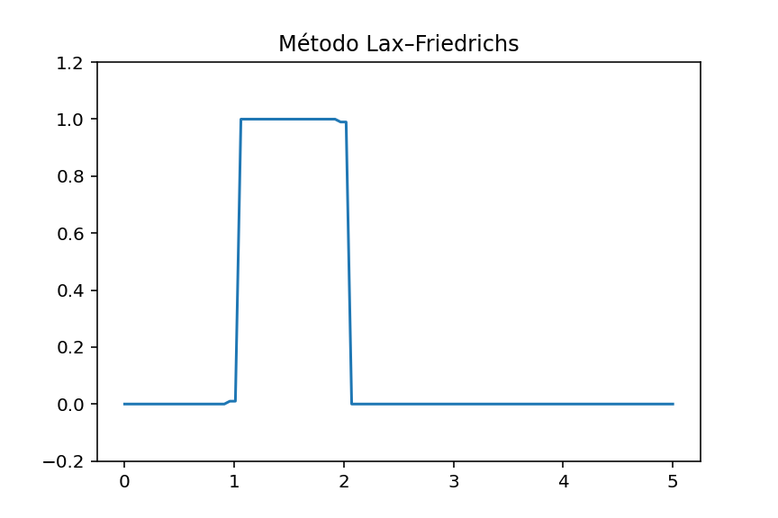

Lax-Friedrichs stabilizes the centered update by adding neighbour averaging. This acts as artificial diffusion: the solution becomes stable but visibly smoother.

---

## 2. Burgers equation

The Burgers simulation starts from a smooth sinusoidal profile:

$$
u(x,0)=2+0.5\sin(2\pi x).$$

Unlike linear advection, the propagation speed is now the solution itself. Larger values of $u$ move faster than smaller values. This produces nonlinear steepening.

### Burgers methods comparison

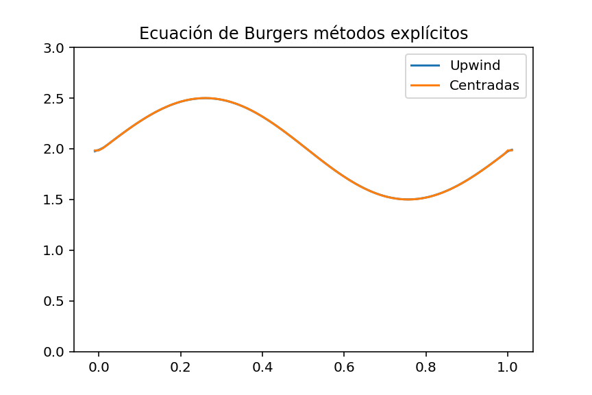

The animation shows the nonlinear deformation of the initial profile. It also illustrates why Burgers equation is a standard benchmark for nonlinear hyperbolic solvers.

### Burgers upwind

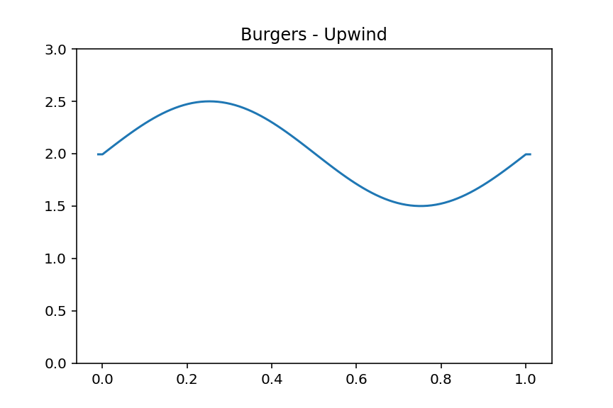

The upwind Burgers scheme uses the local sign of the velocity to select the appropriate stencil. It is more robust near steep gradients but introduces numerical diffusion.

### Burgers centered

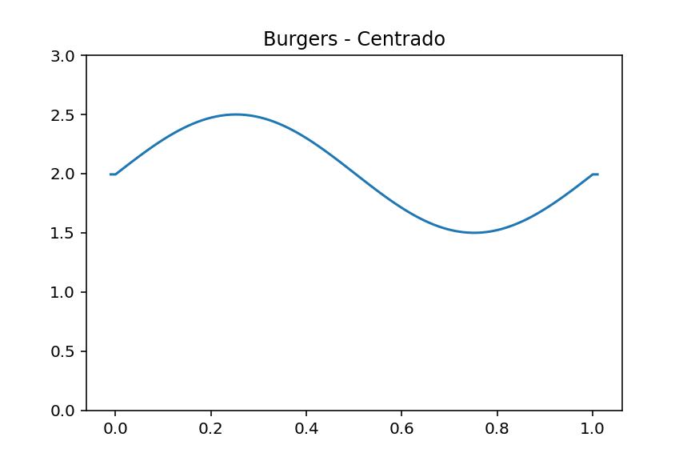

The centered Burgers scheme is less dissipative, but it is more fragile. As gradients steepen, centered methods can generate nonphysical oscillations.

### Classic versus matrix implementation

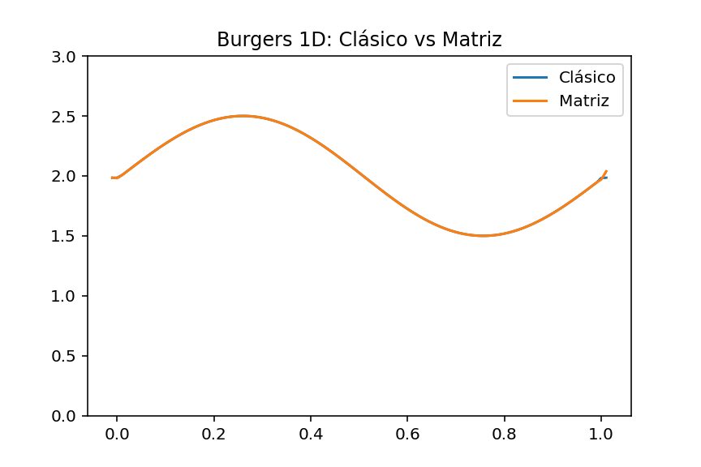

The classic-versus-matrix comparison validates that the same finite-difference logic can be represented through direct loop updates or through an algebraic operator formulation.

---

## Quantitative diagnostics

### Advection error versus timestep

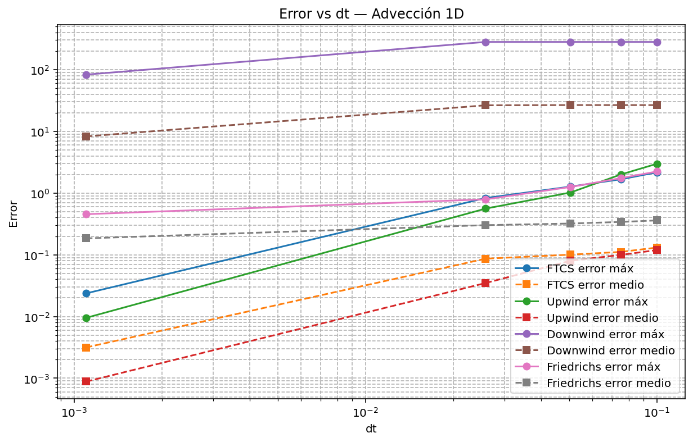

The error increases as the timestep becomes too large. This reflects the role of the Courant number:

$$
\alpha=\frac{c\Delta t}{\Delta x}.
$$

### Advection runtime versus timestep

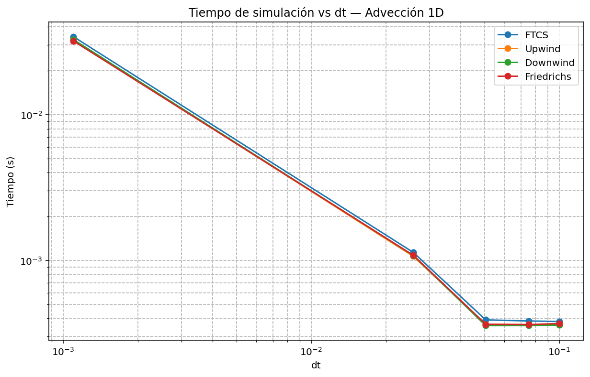

Smaller timesteps require more iterations to reach the same final physical time, increasing runtime.

### Burgers error versus timestep

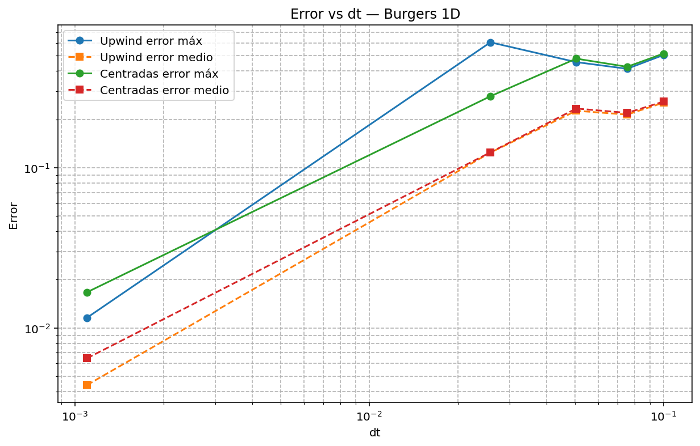

Burgers equation is more sensitive to timestep choice because the local propagation speed depends on $u$.

### Burgers runtime versus timestep

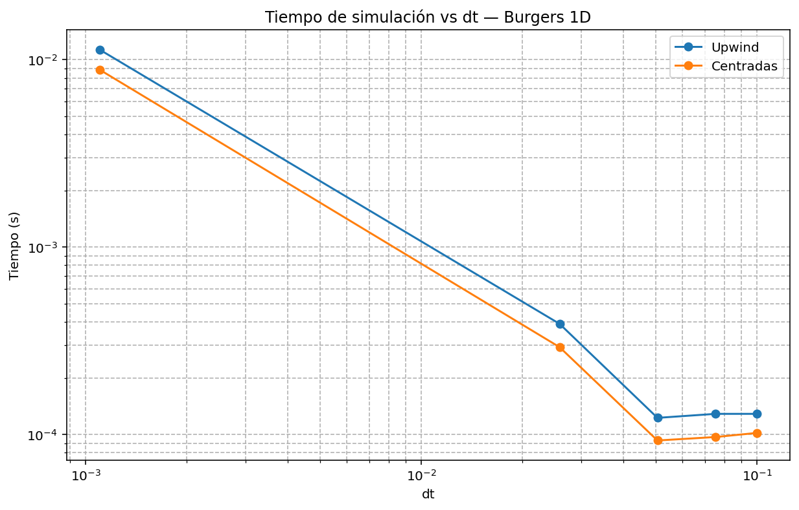

Runtime increases as the timestep decreases, while stability and accuracy generally improve.

### Classic versus matrix Burgers snapshot

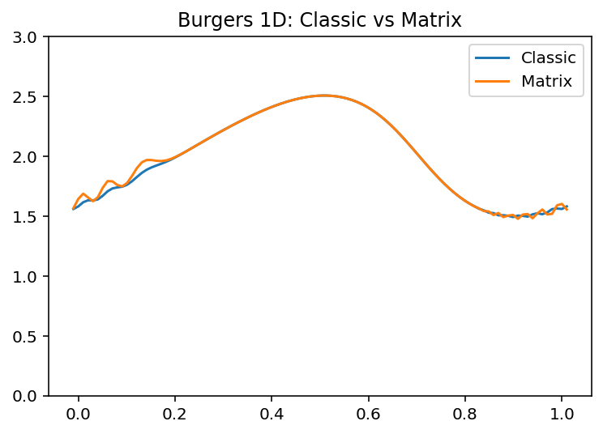

The snapshot compares two implementation styles for the Burgers solver.

### Error versus runtime

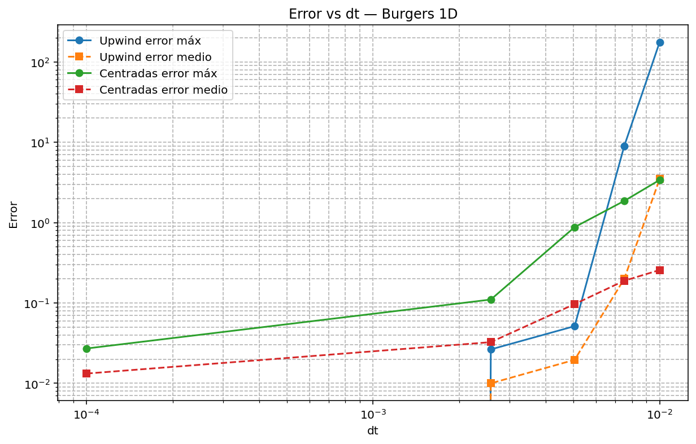

This plot connects accuracy and computational cost, which is essential when evaluating numerical methods.

---

## Repository structure

```text
hyperbolic-pde-advection-burgers/
├── src/
│   └── hyperbolic_advection_burgers.py
├── docs/
│   ├── theory.md
│   ├── numerical_method.md
│   ├── results_summary.md
│   └── sources_and_notes.md
├── figures/
│   ├── advection/
│   ├── burgers/
│   ├── error_analysis/
│   ├── runtime/
│   ├── boundary_conditions/
│   ├── numerical_diffusion/
│   ├── matrix_comparison/
│   └── animations/
├── reports/
├── requirements.txt
├── .gitignore
└── README.md
```
