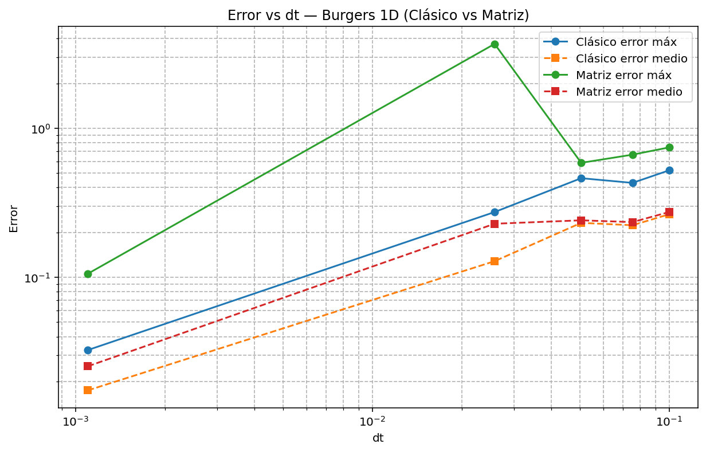
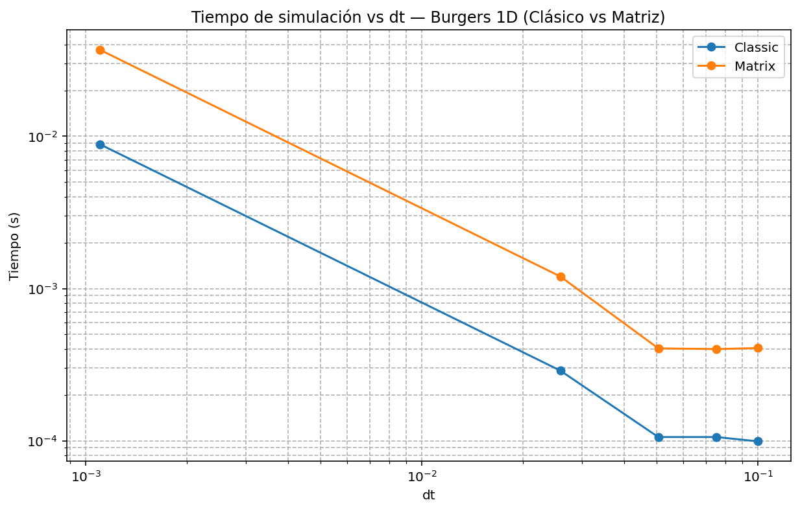

# Hyperbolic PDEs: Linear Advection and Burgers Equation

## 1. Scientific motivation
This portfolio project studies how explicit finite-difference schemes behave for one-dimensional hyperbolic transport problems. The emphasis is on stability, numerical diffusion, boundary handling, and computational cost.

## 2. Equations studied
Linear advection:
$$
\frac{\partial u}{\partial t} + c\frac{\partial u}{\partial x} = 0
$$

Inviscid Burgers:
$$
\frac{\partial u}{\partial t} + u\frac{\partial u}{\partial x} = 0
$$

## 3. Linear advection setup
- 1D spatial grid.
- Square-pulse initial profile.
- Periodic boundary conditions.
- CFL-controlled timestep $\Delta t$.

## 4. GIF animation of advection methods


## 5. Individual advection method animations


## 6. Burgers equation setup
- Inviscid nonlinear transport.
- Sinusoidal initial condition.
- Periodic domain treatment in the update loops.

## 7. GIF animation of Burgers methods


## 8. Numerical schemes
- Advection: FTCS (centered), upwind, downwind, Lax-Friedrichs.
- Burgers: centered and upwind-style explicit updates.
- Additional classic-versus-matrix Burgers implementation comparison.

## 9. CFL stability
The timestep follows a CFL restriction:
$$
\Delta t \leq \text{CFL}\,\frac{\Delta x}{|c|}
$$
for linear advection, with analogous stability control for Burgers using the flow speed scale.

## 10. Numerical diffusion
Scheme-dependent dissipation is analyzed qualitatively through solution shape smoothing and quantitatively through error metrics.

## 11. Boundary-condition comparison
The project includes comparison workflows for Dirichlet, Neumann, and periodic boundary treatments in the hyperbolic setting.

## 12. Error and runtime analysis
### Error-focused figures





### Runtime-focused figures




### Matrix comparison snapshot


## 13. Repository structure
```text
src/
  hyperbolic_advection_burgers.py
docs/
  theory.md
  numerical_method.md
  results_summary.md
  sources_and_notes.md
figures/
  advection/
  burgers/
  error_analysis/
  runtime/
  boundary_conditions/
  numerical_diffusion/
  matrix_comparison/
  animations/
reports/
raw_upload/
```

## 14. Skills demonstrated
- Computational physics modelling of hyperbolic PDEs.
- Finite-difference method comparison.
- Stability and numerical-error analysis.
- Runtime-performance analysis.
- Scientific communication with reproducible project organization.

## 15. Author
**María Lourdes Domínguez Cacho**  
Final-semester Physics student, University of Alicante  
GitHub: [mldc3](https://github.com/mldc3)
